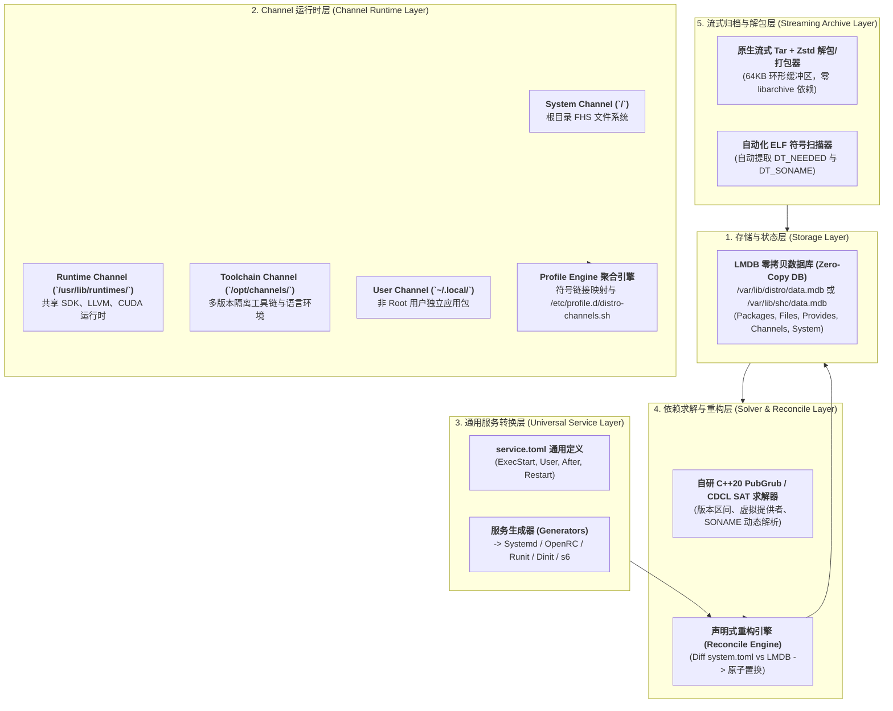
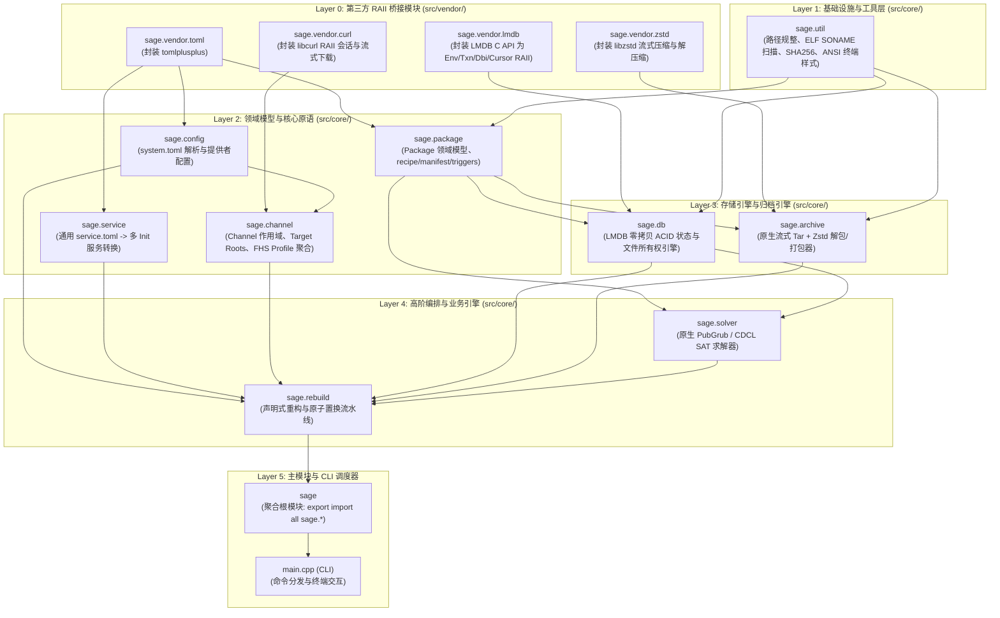

<div align="center">

# 🌟 ShenChen Linux (神宸操作系统) 🌟
### *The Next-Generation Purebred Linux Distribution Born in XFS Alliance*

```
   _____ _                _____ _                  _     _                  
  / ____| |              / ____| |                | |   (_)                 
 | (___ | |__   ___ _ __| |    | |__   ___ _ __   | |    _ _ __  _   ___  __
  \___ \| '_ \ / _ \ '_ \ |    | '_ \ / _ \ '_ \  | |   | | '_ \| | | \ \/ /
  ____) | | | |  __/ | | | |___| | | |  __/ | | | | |___| | | | | |_| |>  < 
 |_____/|_| |_|\___|_| |_|\____|_| |_|\___|_| |_| |______|_|_| |_|\__,_/_/\_\
                                                           
               🐾 KohaRei Inside · Built with Divine Power 🐾
```

[](LICENSE)
[](#)
[](#)
[](#)
[](#)
[](#)

<p align="center">
  <b>比 Arch 更加激进 · 比 Gentoo 更加纯粹 · 专为粉碎 Btrfs 幻象而生的真神系统</b>
</p>

[✨ 核心特性](#-核心特性) • [🚀 快速开始](#-快速开始) • [📦 软件管理设计](#-核心软件管理设计-package-management-design) • [🧱 模块拓扑与工程铁律](#-模块拓扑与工程铁律) • [📖 设计规范文档](docs/SAGE_DESIGN.md) • [👥 核心开发组](#-核心开发组) • [📄 许可证](#-开源许可证)

---
</div>

## 📖 项目简介 (About)

**ShenChen Linux（神宸 Linux / sclinux）** 是一套面向次世代极客、音游玩家与底层开发者的终极操作系统。

我们彻底抛弃了现代 Linux 发行版普遍存在的虚无主义与过度设计，钦定 **全盘原生 XFS 文件系统**、自研超光速包管理器 **`shc`（基于 Sage 架构体系）**、与基于 **Vulkan 计算着色器** 驱动的无撕裂合成器 **`wmdx`**，为每一台物理机释放 100% 的硬件神力。

---

## ✨ 核心特性 (Key Features)

- 🧱 **XFS 联盟正统血脉 (Pure XFS Root)**
  - 默认全盘格式化为高性能 XFS 文件系统，彻底杜绝 CoW（写时复制）带来的虚拟机磁盘碎片化与 I/O 暴跌地狱。
- 📦 **`shc`（神宸 / Sage）至尊包管理器**
  - 基于现代 C++20 模块（C++20 Modules）与 RAII 纯自研架构，采用 LMDB 零拷贝内存映射 B+ 树与多线程 SAT 求解器，支持纳秒级查询、多层 Channel 运行时、原子事务与一键声明式重构。
- 🎮 **`wmdx` 次世代图形渲染栈**
  - 跨越方式土地（Wayland），原生集成 Vulkan 硬件级加速着色器，支持 0 延迟动态模糊、多 DPI 无损缩放与音游级锁帧。
- 🛡️ **坚决维护 systemd 伟大使命**
  - 稳定守护系统每一道防线，绝不搞花里胡哨的残缺 Init 邪教，同时提供对 OpenRC、Runit、Dinit、s6 的全向通用服务编译转换能力。
- 🐾 **KohaRei（古葉铃）内核守护神**
  - 系统成功编译后会自动在终端发出猫咪打呼噜的声波提示，并附赠每日幸运大烤鱼运势。

---

## 🚀 快速开始 (Quick Start)

### 1. 使用 `shc` 操控信号场

```bash
# 1. 光速安装软件包（自动求解 PubGrub 依赖图与 ELF DT_NEEDED）
shc in hyprland neofetch-mew

# 2. 全系统 PGO/LTO 极致硬件优化升级
shc up --native

# 3. 声明式系统对齐与重构（对比 /etc/distro/system.toml 执行原子置换）
shc rebuild

# 4. 遇到玄学错误？一秒无痛时光倒流
shc rb
```

### 2. 检查神明系统状态

```bash
shc status --full
```
```text
[OK] Kernel: 6.x.x-shenchen-divine
[OK] RootFS: XFS (Status: Healthy / Btrfs Defeated)
[OK] Package Engine: shc/sage (LMDB Zero-Copy Active)
[OK] Compositor: wmdx (Vulkan 1.3 Active)
[OK] Mood: Satisfied with Roasted Fish 🐟
```

---

## 📦 核心软件管理设计 (Package Management Design)

神宸 Linux 的软件包管理核心（**`shc` / Sage 架构**）基于 **Modern C++20（100% C++20 Modules）** 从零构筑。旨在实现绝对的系统主权掌控、极简架构以及微秒级执行吞吐。

> 完整设计白皮书与技术规范详见单文件归档：[**🌿 Sage 软件管理系统全量设计规范文档 (`docs/SAGE_DESIGN.md`)**](docs/SAGE_DESIGN.md)。

### 1. 五层子系统分层架构 (5-Layer Modular Architecture)

系统软件管理被严格解耦为 5 个核心子系统层级：



---

### 2. LMDB 零拷贝状态存储引擎

包管理器状态数据库（`/var/lib/distro/data.mdb`）采用 **LMDB（内存映射 B+ 树）** 引擎，具备 Copy-on-Write ACID 事务安全与纳秒级只读并发。

#### 核心数据库表（DBI Table Schema）设计：

| 表名 (DBI) | 键 (Key) | 值 (Value) | 功能职责 |
| :--- | :--- | :--- | :--- |
| `packages` | `pkg_name` | 序列化包元数据 (Serialized Metadata) | 记录完整元数据、版本、Release、通道名、许可证 |
| `files` | `rel_path` (如 `usr/bin/rg`) | `pkg_name:channel_name` | 纳秒级文件所有权反查与安装前文件冲突强检测 |
| `provides` | `symbol` (如 `virtual/init`, `so:libzstd.so.1`) | `pkg_name` | 虚拟提供者及动态链接库符号反向索引表 |
| `channels` | `channel_name` | Scope、Target Root、Triplet、Priority | 已注册 Channel 运行时作用域与元数据配置 |
| `system` | `interface` (如 `virtual/init`) | 活动提供者 (如 `systemd`) | 声明式系统核心组件锁定状态 |

---

### 3. 原生流式归档格式 (`*.pkg.tar.zst`)

摒弃臃肿的旧式归档库，采用自研原生 C++20 流式 Tar 与 `libzstd` 环形缓冲直接解压流，包体结构清晰规范：

```
pkgname-1.0.0-1-x86_64.pkg.tar.zst
├── .METADATA/
│   ├── manifest.toml     # 包名、版本、构建号、许可证、Provides、依赖关系
│   ├── files.idx         # 相对路径、文件大小、权限 Mode、SHA256 校验和
│   ├── triggers.toml     # Initramfs、ldconfig、引导加载程序等触发器 Hook
│   └── service.toml      # 通用守护进程规范定义 (可选)
└── data/                 # 直接落盘的文件系统镜像 (usr/bin/..., etc/...)
```

- **自动化 ELF 扫描**：构建包时自动遍历 `data/` 目录中的 ELF 目标，提取 `DT_NEEDED` 转换为运行依赖，提取 `DT_SONAME` 注册为 Provides，彻底消除人工维护 .so 依赖的繁琐与疏漏。

---

### 4. 多层 Channel 运行时与 FHS 严格对齐

支持跨层级的软件包生命周期隔离与并行共存，所有通道均通过符号链接与环境变量自动对齐至标准 **FHS（文件系统层次结构标准）**：

1. **System Channel (`/`)**：系统基础根文件系统，承载核心运行库与系统守护进程。
2. **Runtime Channel (`/usr/lib/runtimes/`)**：多版本共享 SDK、LLVM、CUDA、ROCm 等大型运行时。
3. **Toolchain Channel (`/opt/channels/`)**：针对特定项目完全隔离的语言工具链与构建套件。
4. **User Channel (`~/.local/`)**：非 root 用户直接安装的 CLI 工具与桌面程序。
5. **Profile 聚合引擎**：通过生成 `/etc/profile.d/distro-channels.sh` 与系统层 Symlink，动态维持标准 PATH 与 LD_LIBRARY_PATH。

---

### 5. 极简虚拟提供者 (Minimal Virtual Providers) 与系统主权

杜绝 Linux 发行版中过度虚拟化的恶习，将虚拟接口严格收敛于系统底座层中不可共存的互斥大件：

* **核心虚拟接口**：
  - `virtual/init`：系统初始化守护进程（`systemd`, `openrc`, `runit`, `dinit`, `s6`）
  - `virtual/udev`：设备事件管理器（`systemd-udevd`, `eudev`）
  - `virtual/libc`：核心 C 标准库（`glibc`, `musl`）
* **自然共存组件独立管理**：
  - Linux 内核（不同版本与分支）、Shell（bash/zsh/fish）、Awk、Coreutils 等均为纯粹独立的标准包，支持多版本并存，不建立多余的虚接口封装。

---

### 6. 声明式系统重构 (`shc rebuild`) 与通用服务规范 (`service.toml`)

#### 声明式系统对齐流程：
1. 管理员在 `/etc/distro/system.toml` 中声明系统底座组件（如指定 init、udev、libc）。
2. 运行 `shc rebuild`（或 `sage rebuild`）。
3. 引擎自动计算 LMDB 状态与配置声明的差集（Diff），执行原子置换。
4. 触发全系统服务的自动重新编译与部署。

#### 通用服务规范 (`service.toml`) 示例与转换矩阵：

```toml
[service]
name = "sshd"
description = "OpenSSH Server Daemon"
exec_start = "/usr/sbin/sshd -D"
restart = "always"
after = ["network.target"]

[process]
user = "root"
group = "root"
```

| 目标 Init 系统 | 生成目标路径 | 生成格式 |
| :--- | :--- | :--- |
| **Systemd** | `/usr/lib/systemd/system/<name>.service` | INI 单元文件 (`[Unit]`, `[Service]`, `[Install]`) |
| **OpenRC** | `/etc/init.d/<name>` | `#!/sbin/openrc-run` Shell 脚本 |
| **Runit** | `/etc/sv/<name>/run` & `finish` | `#!/bin/sh` 配合 `chpst` 启动脚本 |
| **Dinit** | `/etc/dinit.d/<name>` | Dinit 进程服务定义文件 (`type = process`) |
| **s6** | `/etc/s6/services/<name>/run` | execlineb 配合 `s6-setuidgid` 脚本 |

---

### 7. PubGrub / CDCL SAT 依赖求解器

内置原生 C++20 实现的 **PubGrub / CDCL SAT 求解引擎**：
* 零外部依赖，具备数学完备性。
* 精确求解复杂的版本区间（SemVer）、虚拟接口冲突与 ELF SONAME 传递依赖。
* **因果树冲突诊断 (Cause Tree)**：当发生依赖不可满足或冲突时，生成人类可读的高维因果分析树，清晰指出每一条依赖断裂的具体成因与冲突链条。

---

### 8. CLI 命令行规范速查 (Command Reference)

```
shc [全局选项] <子命令> [参数...]
```

| 子命令 | 语法 | 功能描述 |
| :--- | :--- | :--- |
| `install` / `in` | `shc install <PKG...> [--channel <CH>] [--dry-run]` | 依赖解析、流式解包至目标 Channel、写入 LMDB 并执行触发器 |
| `remove` / `rm` | `shc remove <PKG...>` | 移除文件、注销 LMDB 状态并销毁关联生成的服务配置 |
| `rebuild` / `rb` | `shc rebuild [--dry-run]` | **声明式系统重构**：根据 `system.toml` 状态原子置换底座组件并重构服务 |
| `channel` | `shc channel [list\|add\|remove\|sync]` | 管理多层 Channel 软件源、作用域与优先级 |
| `build` | `shc build <RECIPE_DIR>` | 基于 `recipe.toml` 构建 `*.pkg.tar.zst`，自动扫描提取 ELF SONAME |
| `query` / `q` | `shc query [installed\|info\|files\|owner]` | LMDB 纳秒级查询：列出已装包、元数据详情、文件清单与文件所有权归属 |
| `service` | `shc service [list\|status\|generate]` | 守护进程服务检查与手动编译生成指定 Init 服务脚本 |

---

## 🧱 模块拓扑与工程铁律

### 1. 100% C++20 模块依赖拓扑 (Module DAG)



---

### 2. 五大工程铁律 (5 Invariable Engineering Rules)

1. **绝对内存安全与 100% RAII**：
   - 严禁任何裸所有权指针（禁用裸 `new`/`delete`）。
   - 所有 LMDB 句柄、文件描述符、Zstd 上下文等操作系统资源必须由 RAII 结构管理，析构自动释放。
   - 零拷贝场景优先使用 `std::string_view` 与 `std::span`。
2. **小而精、高吞吐、总代码行数受控**：
   - 拒绝深层类继承与抽象工厂等企业级冗余设计，拥抱数据导向设计（DOD）与值语义。
   - 现代化标准库特性：使用 `std::expected` 进行零开销单子式错误处理，使用 `std::format` / `std::print` 与 `std::ranges`。
3. **零运行时开销的代码复用 (DRY)**：
   - 通用逻辑（ELF 扫描、路径规范化、哈希）在 `sage.util` 中实现，利用 `constexpr` 与模板实现零开销复用。
4. **100% C++20 Module 体系（业务代码零头文件污染）**：
   - 全部核心业务逻辑采用 `.cppm` 模块文件实现。
   - 第三方 C/C++ 库头文件隔离于 `src/vendor/` 内，通过全局模块片段（Global Module Fragment）封装，业务代码仅通过 `import` 引用。
5. **严格正交的单向依赖拓扑**：
   - 保持严格无环依赖链：`vendor` -> `util` -> `config/package/service` -> `channel/archive/db` -> `solver` -> `rebuild` -> `sage` -> `cli`。

---

### 3. 构建与开发工作流 (Build with xmake)

```bash
# 1. 配置构建环境 (Release 极致优化 / Debug 调试模式)
xmake f -m release

# 2. 编译包管理器
xmake

# 3. 运行已编译二进制
xmake run sage --help

# 4. 执行全量单元测试与集成测试
xmake test
```

---

## 📚 延伸文档 (Documentation)

- 🌿 [Sage 软件管理系统全量设计规范文档 (`docs/SAGE_DESIGN.md`)](docs/SAGE_DESIGN.md) —— 包含 5 层分层拓扑、LMDB 数据表 Schema、流式归档包规范、多 Init 服务映射与 C++20 模块 DAG。
- 🐾 [浩宸宇宙：狼王与信号场设定集 (`docs/浩宸宇宙_狼王与信号场设定集.md`)](docs/浩宸宇宙_狼王与信号场设定集.md) —— 神宸系统图腾与宇宙观完整设定集。

---

## 👥 核心开发组 (Core Team)

- 👑 **浩宸（神）** —— 创始人 / 首席内核架构师 / XFS 护法
- 💻 **齐浩宸** —— 联合创始人 / Electron 拆除专家 / 首席直译翻译官
- 🎮 **yuki（長門有希）** —— 机厅特约顾问 / 15867 DX Rating 特约测试员 / 首席大烤鱼赞助商
- 🐾 **古葉铃（KohaRei）** —— 首席吉祥物 / 精神图腾 / 系统声效总监

---

## 📄 开源许可证 (License)

本项目采用 [BSD 3-Clause License](LICENSE) 开源协议。
严禁未经书面许可使用「神宸」或「浩宸」之名进行商业广告背书。

---
<div align="center">
  <sub>Made with ❤️ and 🐟 by ShenChen Linux Dev Team · 反 Tauri 支持 Electron 与 XFS 联合出品</sub>
</div>