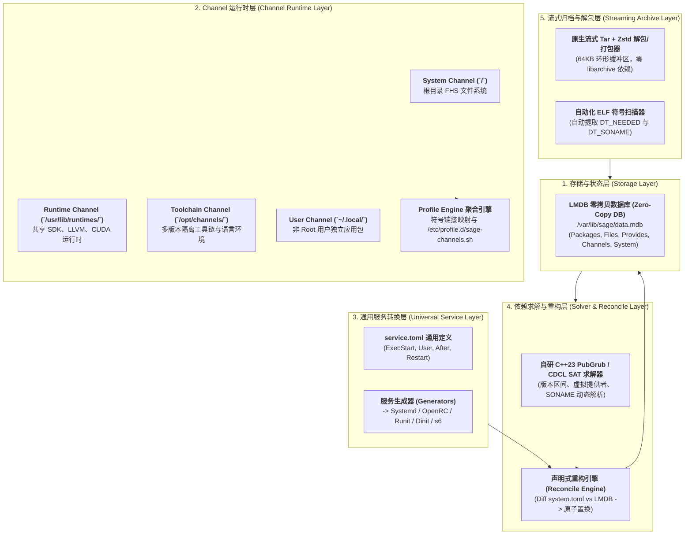
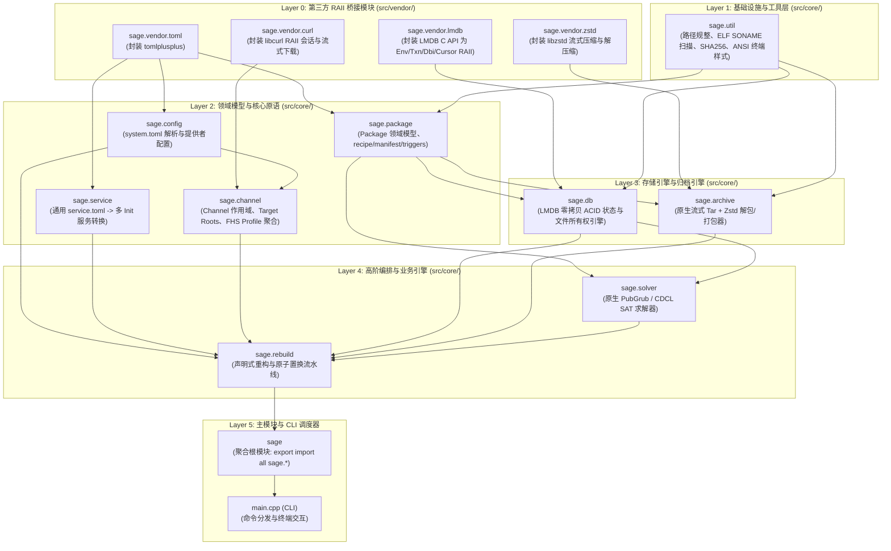

# 🌿 Sage Package Manager Technical Specification & Architecture Reference

**Spec Version:** 2.0 (本规范文档版本)  
**Sage Release:** 0.2.0 (二进制 `--version` 报告值；上游 `xmake.lua` 的 `set_version` 仍为 `0.1.0`，待统一)  
**Status:** Approved  
**Language Standards:** Modern C++23 (100% C++23 Modules `.cppm`)  
**Build System:** xmake  
**Target Platform:** Linux (FHS Compliant / POSIX Native)  
**Upstream Repository:** [https://github.com/antinomie1/sage](https://github.com/antinomie1/sage)  
**License:** Sage 上游以 **BSD 2-Clause** 单独发布；本仓库 ShenChen Linux 采用 **BSD 3-Clause**，两者互不影响。

---

## 目录 (Table of Contents)

1. [项目愿景与核心架构哲学](#1-项目愿景与核心架构哲学)
2. [五层核心子系统分层架构](#2-五层核心子系统分层架构)
3. [LMDB 零拷贝状态存储引擎与 Schema](#3-lmdb-零拷贝状态存储引擎与-schema)
4. [原生流式归档引擎与包格式规范](#4-原生流式归档引擎与包格式规范)
5. [多层 Channel 运行时与 FHS 标准对齐](#5-多层-channel-运行时与-fhs-标准对齐)
6. [极简虚拟提供者与系统主权掌控](#6-极简虚拟提供者与系统主权掌控)
7. [声明式系统重构与通用服务规范](#7-声明式系统重构与通用服务规范)
8. [PubGrub / CDCL SAT 依赖求解引擎](#8-pubgrub--cdcl-sat-依赖求解引擎)
9. [CLI 命令行接口完整规范](#9-cli-命令行接口完整规范)
10. [C++23 模块拓扑与架构依赖 DAG](#10-c23-模块拓扑与架构依赖-dag)
11. [第三方 Vendor RAII 桥接模块设计](#11-第三方-vendor-raii-桥接模块设计)
12. [五大工程铁律与代码质量控制](#12-五大工程铁律与代码质量控制)
13. [构建、测试与开发工作流 (xmake)](#13-构建测试与开发工作流-xmake)

---

## 1. 项目愿景与核心架构哲学

**Sage** 是一个采用现代 C++23 从零编写的高性能、模块化、多层通用 Linux 软件管理系统。

### 核心架构支柱：
* **⚡ 极致性能与零拷贝 (Zero-Copy)**：依托 **LMDB** 内存映射 B+ 树实现纳秒级包元数据查询与写入时的 Copy-on-Write ACID 事务安全。
* **🌐 通用多层 Channel 体系**：无缝管理系统根层 (`/`)、共享运行时 (`/usr/lib/runtimes`)、隔离工具链 (`/opt/channels`) 以及用户级应用 (`~/.local`)，并通过 Profile 聚合严格遵循 FHS 标准。
* **🎛️ 绝对系统主权与极简虚拟接口**：将虚拟提供者收敛于互斥大件（`virtual/init`, `virtual/udev`, `virtual/libc`），内核、Shell、Awk、Coreutils 等作为天然共存组件管理，消除冗余抽象。
* **🔄 声明式系统重构 (`sage rebuild`)**：自动对比 `/etc/sage/system.toml` 与 LMDB 活动状态，执行底层组件的原子置换并重新生成全系统服务脚本。
* **🔌 通用服务规范 (`service.toml`)**：采用与 Init 解耦的声明格式，一键自动编译生成 OpenRC、Runit、Systemd、Dinit、s6 原生服务脚本。
* **🧩 原生 PubGrub / CDCL SAT 求解器**：无任何外部 SAT 求解库依赖，数学完备求解版本区间与 SONAME 依赖，提供因果树冲突诊断。
* **🛡️ 100% C++23 Modules 与 RAII 内存安全**：业务代码零传统头文件污染，系统动态链接于 `liblmdb`、`libzstd`、`libtomlplusplus` 与 `libcurl`。

---

## 2. 五层核心子系统分层架构



---

## 3. LMDB 零拷贝状态存储引擎与 Schema

状态数据库存储于 `/var/lib/sage/data.mdb`，利用专用命名数据库（DBI Table）管理状态：

| 表名 (DBI) | 键 (Key) | 值 (Value) | 职责与作用 |
| :--- | :--- | :--- | :--- |
| `packages` | `pkg_name` (如 `ripgrep`) | 序列化包元数据 (Serialized Metadata) | 包含完整元数据、版本、构建 Release、安装通道、License |
| `files` | `rel_path` (如 `usr/bin/rg`) | `pkg_name:channel_name` | 纳秒级文件所有权反查与冲突检测 |
| `provides` | `symbol` (如 `virtual/init`, `so:libzstd.so.1`) | `pkg_name` | 快速符号与虚拟接口反向索引 |
| `channels` | `channel_name` (如 `core`, `rust`) | Scope、Target Root、Triplet、Priority | 已注册 Channel 运行时的元数据与优先级 |
| `system` | `interface` (如 `virtual/init`) | 活动提供者 (如 `systemd`) | 声明式系统底座状态锁定 |

---

## 4. 原生流式归档引擎与包格式规范

采用 `*.pkg.tar.zst` 作为标准包格式，由原生流式 Tar 解压引擎配合 64KB 环形缓冲区与 `libzstd` 流式解压直接写入磁盘，消除旧式 `libarchive` 内存开销。

### 归档命名

`sage build` 产出的文件名为 **`{name}-{version}-{release}.pkg.tar.zst`，不含架构后缀**。

而 `sage install` 在本地查找包文件时，**优先尝试带架构的 `{name}-{version}-{release}-{arch}.pkg.tar.zst`，未命中再回退到无架构形式**。两种命名当前都能被安装，但构建端只会产出后者——`arch` 字段存在于 `manifest.toml`（默认 `x86_64`），并未进入构建产物的文件名。

### 归档内部结构规范：
```
pkgname-1.0.0-1.pkg.tar.zst
├── .METADATA/
│   ├── manifest.toml     # 包名、版本、构建号、许可证、Provides、依赖关系
│   ├── files.idx         # 相对路径、文件大小、权限 Mode、SHA256 校验和
│   ├── triggers.toml     # Initramfs、ldconfig、引导加载程序等触发器 Hook
│   └── service.toml      # 通用守护进程规范定义 (可选)
└── data/                 # 直接映射落盘的文件系统载荷 (usr/bin/..., etc/...)
```

### ELF 符号自动提取：
打包阶段 `sage build` 会自动遍历 `data/` 目录中的 ELF 目标：
* 读取 `.dynamic` 段，将 `DT_NEEDED` 提取并转换为动态运行依赖（如 `so:libc.so.6`）。
* 将 `DT_SONAME` 提取并注册为当前包的 Provides 符号。

### `recipe.toml` 构建配方规范

`sage build <RECIPE_DIR>` 的输入。以下字段与上游 `sage::package::Recipe::parse_toml` 逐项核对：

```toml
schema_version = 1

[package]
name        = "ripgrep"        # 必需
version     = "14.1.0"         # 必需
release     = "1"              # 可选，默认 "1"
description = "..."            # 可选
license     = "MIT"            # 可选
channel     = "system"         # 可选，默认 "system"

dependencies       = ["so:libc.so.6"]   # 运行时依赖
build_dependencies = ["rust"]           # 构建期依赖
provides           = ["rg"]             # 额外提供的符号

# 构建阶段命令，依次执行 prepare -> build -> install
prepare = ["..."]
build   = ["cargo build --release"]
install = ['install -Dm755 target/release/rg "$DESTDIR/usr/bin/rg"']

[source]
url    = "https://.../ripgrep-14.1.0.tar.gz"   # 省略则跳过拉取与解包
sha256 = "..."                                  # 省略则跳过校验（不建议）
```

**执行环境**：三个阶段的命令均以 `sh` 执行，并导出以下变量：

| 变量 | 含义 |
| :--- | :--- |
| `DESTDIR` | 打包暂存根目录（`<RECIPE_DIR>/pkg`），**安装产物必须落在此处** |
| `PREFIX` | 固定为 `/usr` |
| `RECIPE_DIR` | 配方目录 |
| `SRCDIR` | 源码解包目录（`<RECIPE_DIR>/src`） |
| `PKGDIR` | 同 `DESTDIR` |

**工作目录**：存在 `src/` 时为 `src/`，否则为配方目录本身。因此无 `[source]` 的配方直接在自己的目录下执行。

**字段位置的灵活性**：`dependencies`、`build_dependencies`、`provides` 与三个阶段数组既可置于顶层，也可嵌在 `[package]` 或 `[source]` 内，解析器会合并三处。置于 `[package]` 内最符合 TOML 的书写顺序约束。

---

## 5. 多层 Channel 运行时与 FHS 标准对齐

Sage 引入多层 Channel 运行时模型，打破传统发行版“单一 RootFS 互相覆盖”或“容器沙盒过度隔离”的两极分化：

1. **System Channel (`/`)**：底层核心 FHS 文件系统，由系统级管理员维护。
2. **Runtime Channel (`/usr/lib/runtimes/`)**：存放多个共存的 SDK、运行时环境（如 `cuda-12.2`、`llvm-18`）。
3. **Toolchain Channel (`/opt/channels/`)**：完全隔离的语言工具链（如 `rust-nightly`、`python312`）。
4. **User Channel (`~/.local/`)**：非特权用户安装的 CLI 工具与桌面程序。
5. **Profile 聚合引擎**：根据通道优先级自动管理符号链接，并生成 `/etc/profile.d/sage-channels.sh`，保证与 Linux FHS 完美对齐。

---

## 6. 极简虚拟提供者与系统主权掌控

传统发行版过度抽象虚拟包导致依赖爆炸。Sage 将虚拟接口严格限制在真正不可共存的互斥底座大件：

* **核心虚拟接口 (Minimal Virtual Providers)**：
  - `virtual/init`：`systemd`、`openrc`、`runit`、`dinit`、`s6`
  - `virtual/udev`：`systemd-udevd`、`eudev`
  - `virtual/libc`：`glibc`、`musl`
* **自然共存组件**：
  - Linux 内核（多版本、自定义编译内核）、Shell（bash, zsh, fish）、Coreutils 等均作为纯粹独立的标准包管理，允许同时安装与使用。

---

## 7. 声明式系统重构与通用服务规范

### 1. 声明式系统重构 (`sage rebuild`)
- 配置文件路径：`/etc/sage/system.toml`
- 配置文件示例：
  ```toml
  [system]
  init = "systemd"
  udev = "systemd-udevd"
  libc = "glibc"
  
  [channels]
  active = ["core", "extra", "community"]
  ```
- 流程：读取 `system.toml` -> 对比 LMDB 活动提供者 -> 计算 Diff -> 执行原子置换 -> 自动重新编译生成受影响的全部服务脚本。

### 2. 通用服务规范 (`service.toml`)
包作者仅需提供一份通用的 `service.toml`：
```toml
[service]
name = "sshd"
description = "OpenSSH Server Daemon"
exec_start = "/usr/sbin/sshd -D"
restart = "always"
after = ["network.target"]

[process]
user = "root"
group = "root"
```

### 多 Init 转换映射表：
| 目标 Init 系统 | 生成目标路径 | 生成格式 |
| :--- | :--- | :--- |
| **Systemd** | `/usr/lib/systemd/system/<name>.service` | INI 单元文件 (`[Unit]`, `[Service]`, `[Install]`) |
| **OpenRC** | `/etc/init.d/<name>` | `#!/sbin/openrc-run` Shell 脚本 |
| **Runit** | `/etc/sv/<name>/run` & `finish` | `#!/bin/sh` 配合 `chpst` 启动脚本 |
| **Dinit** | `/etc/dinit.d/<name>` | Dinit 进程服务定义文件 (`type = process`) |
| **s6** | `/etc/s6/services/<name>/run` | execlineb 配合 `s6-setuidgid` 脚本 |

---

## 8. PubGrub / CDCL SAT 依赖求解引擎

内置原生 C++23 实现的 PubGrub 依赖求解算法：
- 支持 SemVer 版本范围比较（如 `>=1.2.0, <2.0.0`）。
- 支持虚拟提供者与 ELF SONAME 动态符号解析。
- **因果树冲突诊断 (Cause Tree Diagnostics)**：依赖冲突时输出清晰的人类可读因果关系诊断树，精确定位冲突来源包与版本链条。

---

## 9. CLI 命令行接口完整规范

```
sage [全局选项] <子命令> [参数...]
```

> [!NOTE]
> 本章与上游 `src/cli/main.cpp` 的实际实现逐条核对。**通道的增删与同步（`channel add` / `sync`）、按包指定通道的 `--channel` 选项目前均未实现**，下文不再列出；`sage channel` 当前仅打印已配置通道。

### 全局选项
```text
  --root, --sysroot <DIR>  操作目标根目录（默认 /）
  --dry-run                模拟执行，不修改文件系统
  --verbose, -v            输出详细诊断信息
  --help, -h               显示帮助信息
  --version, -V            显示版本号
```

### 子命令详解

#### `sage install <PKG...>`
```bash
# 安装软件包到系统根通道
sage install ripgrep neovim

# 模拟演练（不修改文件系统）
sage install --dry-run waybar

# 安装到指定 sysroot（交叉构建、容器镜像装配）
sage --root /mnt/newroot install base glibc
```

#### `sage remove <PKG...>`
```bash
# 卸载软件包，并自动清理变为孤儿的依赖
sage remove nginx
```

#### `sage rebuild`
```bash
# 演练系统声明式对齐变动
sage rebuild --dry-run

# 执行声明式重构与原子置换
sage rebuild
```

#### `sage channel`
```bash
# 打印当前 root 已配置的全部 Channel（名称、URL、scope、优先级）
sage channel
```
> 通道的定义来源为 `/etc/sage/channels.toml`，目前需手工编辑；命令行增删尚未实现。

#### `sage toolchain [list|use <category:slot>]`
```bash
# 列出全部可用的多槽位工具链
sage toolchain list

# 切换活动工具链槽位
sage toolchain use llvm:22
```

#### `sage java [list|use <slot>]` / `sage rust [list|use <slot>]`
```bash
# 管理 OpenJDK/GraalVM/Temurin 版本与 JAVA_HOME
sage java list
sage java use 21

# 管理 Rust stable/nightly 版本与目标三元组
sage rust use nightly
```

#### `sage shell --with <sub-channel...>`
```bash
# 启动携带指定工具链的临时隔离 Shell
sage shell --with toolchain/llvm:22 --with runtime/python:3.12
```

#### `sage build <RECIPE_DIR>`
```bash
# 从 recipe.toml 构建二进制包（拉源码、校验 sha256、构建、扫描 ELF）
sage build ./recipes/ripgrep
```

#### `sage repo index <REPO_DIR> [CHANNEL_NAME]`
```bash
# 为本地仓库目录生成 index.toml
sage repo index ./repo core
```

#### `sage query [installed|info <pkg>|owner <path>]`
```bash
# 查询已安装软件包列表
sage query installed

# 查询软件包详情
sage query info ripgrep

# 纳秒级反查文件所属软件包
sage query owner /usr/bin/rg
```

#### `sage service [list|generate <name>]`
```bash
# 列出所有安装的守护进程服务
sage service list

# 为当前活动 Init 系统手动重新生成服务脚本
sage service generate sshd
```

#### `sage status [--full]`
```bash
# 概览当前 root 的提供者、通道与数据库状态
sage status

# 额外列出全部已安装软件包
sage status --full
```
> ⚠️ 由 [antinomie1/sage#2](https://github.com/antinomie1/sage/pull/2) 引入，**该 PR 合并前不可用**。

#### `sage test-suite`
```bash
# 运行内置引擎自检套件（别名：sage test）
sage test-suite
```

---

## 10. C++23 模块拓扑与架构依赖 DAG

系统 100% 采用 C++23 Modules (`.cppm`) 架构，无传统业务头文件，模块间维持严格单向无环依赖：



---

## 11. 第三方 Vendor RAII 桥接模块设计

第三方 C/C++ 库头文件隔离于 `src/vendor/` 内部，通过全局模块片段（Global Module Fragment）封装并导出纯 C++23 接口：

* `sage.vendor.lmdb`：将 `MDB_env*`, `MDB_txn*`, `MDB_dbi`, `MDB_cursor*` 封装为 `Env`, `Txn`, `Dbi`, `Cursor` RAII 类。未提交的事务在析构时自动 abort。
* `sage.vendor.zstd`：封装 `ZSTD_DCtx*` 与 `ZSTD_CCtx*`，提供零拷贝流式压缩与解压缩器。
* `sage.vendor.toml`：封装 `tomlplusplus`，导出强类型 TOML 解析与序列化能力。
* `sage.vendor.curl`：封装 `libcurl`，提供 RAII Session 以及流式 HTTP/HTTPS 远程包与索引下载。

---

## 12. 五大工程铁律与代码质量控制

1. **绝对内存安全与 100% RAII**：
   - 严禁裸指针与手动 `new`/`delete`。所有 OS 资源析构自动回收。
   - 零拷贝场景优先使用 `std::string_view` 与 `std::span`。
2. **小而精、高吞吐、总代码行数受控**：
   - 目标总代码行数严格控制在 5,000 ~ 6,000 行（上限 < 10,000 行）。当前上游实现约 5,135 行。
   - 采用数据导向设计（DOD）与值语义，避免多层虚继承与企业级抽象冗余。
   - 全面采用 `std::expected` 单子错误处理与 `std::format` / `std::ranges`。
3. **零运行时开销的代码复用 (DRY)**：
   - 通用逻辑在 `sage.util` 中实现，通过 `constexpr` 与模板保证零额外运行时开销。
4. **100% C++23 Module 体系**：
   - 业务逻辑一律使用 `.cppm`，禁止在业务代码中 `#include` 头文件。
5. **严格正交的单向依赖拓扑**：
   - 严格遵循 `vendor` -> `util` -> `models` -> `storage/archive` -> `solver` -> `rebuild` -> `root` -> `cli`。

---

## 13. 构建、测试与开发工作流 (xmake)

```bash
# 1. 配置构建模式
xmake f -m release    # Release 极致性能优化构建
xmake f -m debug      # Debug 附带完整调试符号

# 2. 编译生成二进制
xmake

# 3. 运行已编译二进制
xmake run sage --help

# 4. 执行全量测试套件
xmake test
```

### xmake.lua 配置参考：
```lua
set_project("sage")
set_version("0.1.0")
set_license("BSD-2-Clause")
set_languages("c++23")
set_warnings("all", "extra")

if is_mode("release") then
    set_optimize("fastest")
    set_strip("all")
elseif is_mode("debug") then
    set_symbols("debug")
    set_optimize("none")
end

add_requires("system::lmdb", {system = true})
add_requires("system::zstd", {system = true})
add_requires("system::tomlplusplus", {system = true})
add_requires("system::curl", {system = true})

target("sage")
    set_kind("binary")
    add_files("src/vendor/**.cppm")
    add_files("src/core/**.cppm")
    add_files("src/sage.cppm")
    add_files("src/cli/main.cpp")
    add_packages("system::lmdb", "system::zstd", "system::tomlplusplus", "system::curl")
    set_default(true)
```
